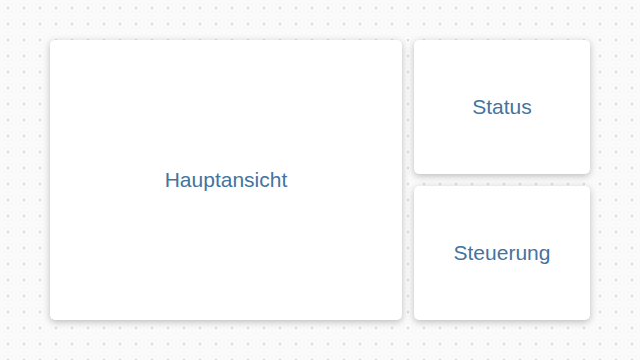
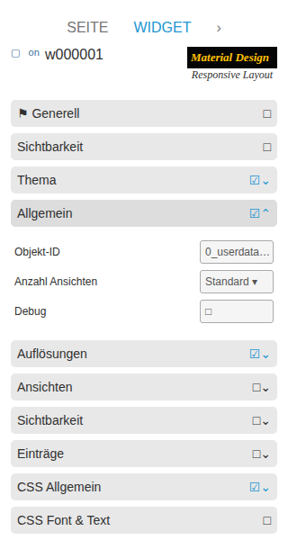

# Responsive Layout

[Back to README](../../../README.md#widget-documentation)

Responsive VIS 2 containers for Masonry Views, Grid Views and state-controlled
embedded views.

Template ids: `tplVis2-materialdesign-Masonry-Views`,
`tplVis2-materialdesign-Grid-Views`, `tplVis2-materialdesign-view-in-widget`
and `tplVis2-materialdesign-view-in-widget8`.

## Editor settings

<table>
<tr><td></td>
<td><ul><li><b>Resolutions:</b> define layout breakpoints.</li><li><b>Views:</b> configure the indexed embedded VIS 2 views.</li><li><b>Masonry:</b> flowing columns; <b>Grid:</b> explicit grid spans.</li><li><b>Advanced View:</b> selects one embedded view from a state value.</li></ul></td></tr>
</table>

Embedded content uses the native VIS 2 child-view mechanism; it does not change
the active top-level view.
