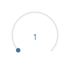
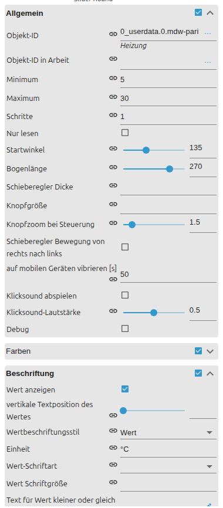

# Slider Round

[User guide](../README.md) › [Widget catalog](README.md) · [Deutsch](../../de/widgets/slider-round.md)

A circular native VIS 2 slider for numeric states. Template id:
`tplVis2-materialdesign-Slider-Round`.

## Editor settings

The screenshot shows the **General** and **Label** groups expanded. Settings not
listed below are self-explanatory. The editor UI follows the ioBroker system
language, so the screenshots are German.

**General**

- **oid** – value state; **oid-working** optionally reports that a device is still moving.
- **min / max / step** – value range and increment.
- **start angle / arc length** – where the circular track begins and how far it sweeps.
- **slider width / handle size** – stroke thickness and knob size.
- **rtl** – reverses the direction (counter-/clockwise).
- **read only** – shows the value without accepting input.

**Label**

- **value label style / unit** – raw value or percent, plus a unit suffix.
- **vertical position** – places the value label in the center.
- **min / max texts** and **less-than / greater-than replacement texts** – show fixed text below/above a limit instead of the number.

The **Colors** group controls the track background, the active arc (before/after
the knob) and the knob itself.
