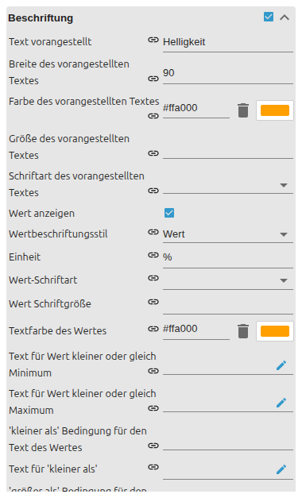

# Slider

[User guide](../README.md) › [Widget catalog](README.md) · [Deutsch](../../de/widgets/slider.md)

A horizontal or vertical native VIS 2 slider that reads and writes a numeric
state. Template id: `tplVis2-materialdesign-Slider`.

## Editor settings

The screenshots show the groups that shape behaviour and labelling. Settings not
listed below are self-explanatory. The editor UI follows the ioBroker system
language, so the screenshots are German.

**General**

- **oid** – the value state; **oid-working** optionally reports that a device is still moving to the target.
- **orientation / reverse** – horizontal or vertical, and inverted direction.
- **min / max / step** – value range and increment.
- **read only** – shows the value but never writes it.

**Scale (ticks)**

- **show ticks** – draws tick marks along the track.
- **tick labels** – shows the value at each tick; tick size and colors follow.

**Label**

- **prepend text** – caption shown left of the slider.
- **value label style / unit** – raw value or percent, plus a unit suffix.
- **min / max texts** and **less-than / greater-than replacement texts** – show fixed text at the ends or below/above a limit instead of the number.

**Thumb label**

- **show thumb label** – off, while dragging or always.
- Thumb **size**, background and font colors follow.
