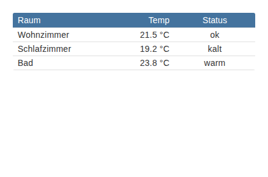
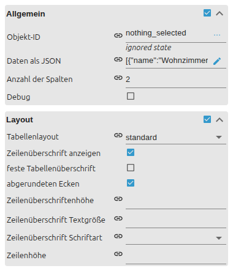
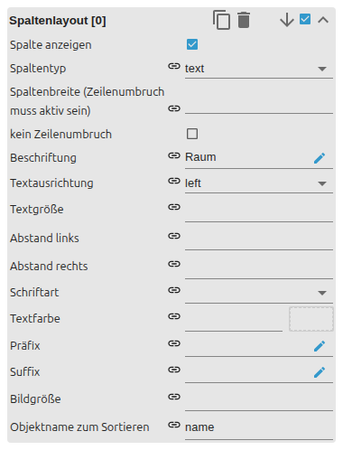

# Table

[User guide](../README.md) › [Widget catalog](README.md) · [Deutsch](../../de/widgets/table.md)

A native VIS 2 table for JSON rows with configurable indexed columns. Template
id: `tplVis2-materialdesign-Table`.



## Editor settings

The screenshots show the general/layout groups and one indexed column. Settings
not listed below are self-explanatory. The editor UI follows the ioBroker system
language, so the screenshots are German.



**General**

- **oid / data JSON** – a JSON array taken from a state, or entered directly as text.
- **column count** – number of indexed **Column [n]** groups.

**Layout**

- **table layout** – standard, card or outlined card.
- **show header / fixed header** – header row and whether it stays on scroll.
- **row height / round border** – row spacing and rounded corners.

Each column is configured in its own indexed group:



- **label** – column header text.
- **column type** – text or image cell.
- **sort key** – the JSON property this column reads and sorts by.
- **width / alignment / no-wrap** – column sizing and text behaviour.
- **prefix / suffix** – text added around the cell value.

Display order follows the JSON property order.

```json
[{ "device": "Temperature", "room": "Living room", "value": "22.4 °C" }]
```

Use a JSON object with the same property order for every row.
