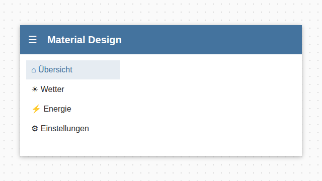
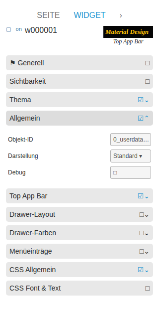

# Top App Bar

[Back to README](../../../README.md#widget-documentation)

A VIS 2 top app bar with responsive navigation drawer and indexed menu items.
Template id: `tplVis2-materialdesign-TopAppBar-Navigation`.

## Editor settings

<table>
<tr><td></td>
<td><ul><li><b>Top App Bar:</b> standard, dense or short layout, title and colors.</li><li><b>Drawer:</b> modal, permanent or automatic by screen width.</li><li><b>Menu data:</b> indexed editor entries or JSON.</li><li>Each item can define id, label, header, divider, icon, submenus and permissions.</li></ul></td></tr>
</table>

The selected index is written to the configured object id. An optional second
state receives the selected item name.
