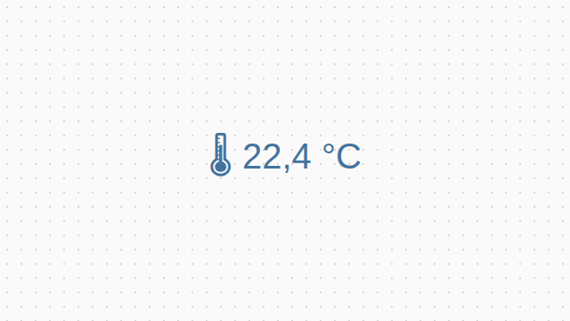
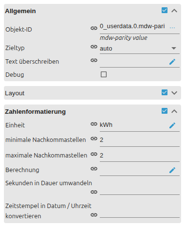
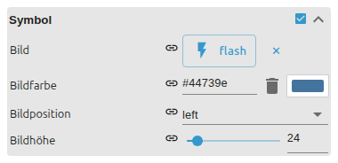

# Value

[User guide](../README.md) › [Widget catalog](README.md) · [Deutsch](../../de/widgets/value.md)

Displays an ioBroker state as text, number, boolean or linked value, with
formatting, prefix/suffix and optional icon. Template id:
`tplVis2-materialdesign-value`.

## Editor settings

The screenshots show the groups that shape the output. Settings not listed below
are self-explanatory. The editor UI follows the ioBroker system language, so the
screenshots are German.

**General**

- **target type** – how the state is interpreted: `auto`, number, string, boolean or *linked* (a clickable value opening the object).
- **prefix / suffix** – fixed text before / after the value (a unit, a label).

**Number formatting**

- **min / max decimals** – number of fractional digits shown.
- **unit** – unit text appended to the number.
- **calculation** – math expression applied to the value before display (e.g. `x/1000` for Wh → kWh).
- **convert to duration / to timestamp** – render a number of seconds as `hh:mm:ss`, or a timestamp as a formatted date/time.

**Icon**

- **image** – Material Design icon name, image path/URL or data URL shown next to the value.
- **icon position** – before or after the value.
- **icon color / height** – recolor (single-color SVG) and size of the icon.

A separate **Boolean formatting** group appears once the target type is boolean:
it holds the **text for true / false** and a **condition** value that decides the
true/false state for non-boolean inputs. The change effect briefly highlights
updated values.
